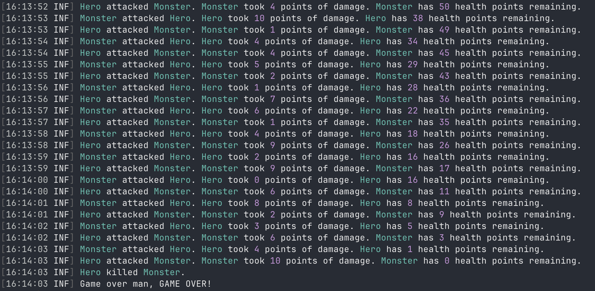

# RPG Simulator

This project is a simple app that demonstrates some dotnet features.

It's a console app that simulates a battle between a Hero and a Monster.

Run locally:
```
dotnet run --project src/Game --launch-profile Game
```

Test locally:
```
dotnet test
```

Build OCI image with [pack](https://github.com/buildpacks/pack) and run with docker:
```
pack build --default-process Game --builder heroku/builder:24 rpg
docker run --rm --env DOTNET_ENVIRONMENT=Development rpg
```

